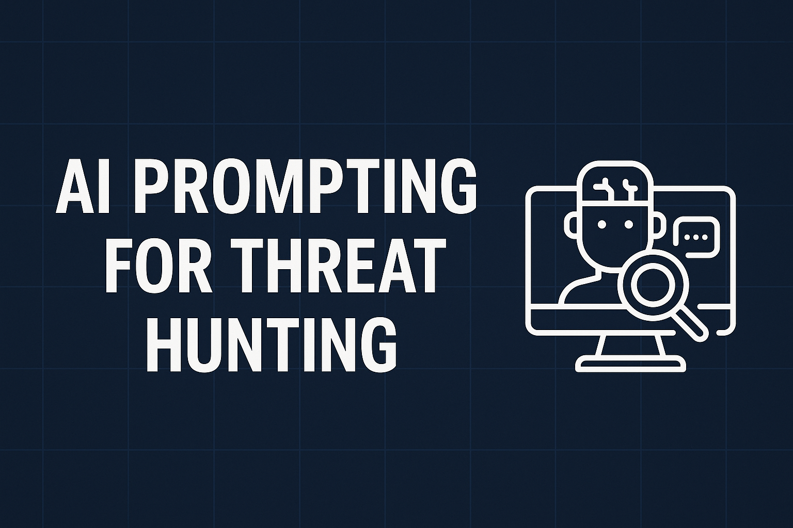

# AI Prompting for Threat Hunting — Field Guide


This repository is designed as a companion field-guide for SOC analysts and detection engineers looking to harness large-language models (LLMs) for threat hunting. You’ll find end-to-end prompt frameworks, ready-to-use templates, and example workflows across Windows, Azure, AWS and Elastic.
> **Status:** v0.4 (examples + graphic integration)  
> **Maintainer:** Juan Rivera (juansasoc)  
> **Scope:** Practical prompt patterns, reusable templates, and examples to accelerate threat hunting and detection engineering with LLMs.

---

## 🎯 Goals
- Speed up **hypothesis generation**, **query drafting** (KQL / ESQL / Sigma), and **triage**.
- Provide **safe-by-default** prompt designs that reduce hallucinations and enforce verifiability.
- Offer ready-to-run **copy/paste templates** and an evaluation rubric.

---

## 🧱 Principles
1. **Evidence > Eloquence**: require explicit assumptions, inputs, and references.
2. **Schema-first**: always define the data source and fields before asking for analytics.
3. **Reproducible output**: prefer structured JSON or fenced code blocks with the correct language (e.g., `kql`, `esql`, `yaml`).
4. **Guardrails**: ask the model to state uncertainty, list missing context, and propose validation steps.
5. **Least-privilege data**: redact or hash sensitive data; avoid sending raw PII or secrets.

---

## 📦 Repository Layout
```
AI-Prompting-for-Threat-Hunting/
├─ README.md
├─ assets/
│  └─ banner.png
├─ prompts/
│  ├─ foundation-prompts.md
│  ├─ windows.md
│  ├─ cloud-azure.md
│  ├─ cloud-aws.md
│  ├─ elastic-esql.md
│  ├─ sigma.yaml
│  └─ triage-and-reports.md
├─ examples/
│  ├─ windows-persistence.md
│  ├─ windows-defense-evasion.md
│  ├─ aws-iam-anomalies.md
│  ├─ aws-guardduty-suspicious-ip.md
│  ├─ azure-signin-risk.md
│  ├─ azure-keyvault-access.md
│  ├─ elastic-esql-lateral-movement.md
│  └─ elastic-esql-injection.md
├─ checklists/
│  ├─ prompt-eval-rubric.md
│  └─ data-sanity-check.md
└─ LICENSE
```

---

## 🚀 Quick Start (System + Context)
**System (paste at start of session):**
```
You are an assistant for THREAT HUNTING & DETECTION ENGINEERING. Follow these rules:
- Ask for missing context first (log source, schema, timeframe, environment).
- Be explicit about uncertainty; never invent fields or events.
- Output code in fenced blocks with the correct language (kql, esql, yaml).
- For each answer provide: (1) assumptions, (2) validation steps, (3) alternatives.
- Prefer minimal, testable queries. Optimize only after a working baseline.
```

**Context preamble (fill these):**
```
Platform: <Windows / Elastic / Sentinel / AWS>
Data source(s): <e.g., Sysmon v13, CloudTrail, AzureSignInLogs>
Timeframe: <e.g., last 24h>
Schema: <list the fields and types you actually have>
Objective: <e.g., detect suspicious PowerShell download cradle>
```

---

## 🧰 Prompt Templates (Core)
- Hypothesis Generation
- Schema Extraction (from sample logs)
- KQL/ES|QL Draft from Description
- Sigma Rule Scaffold
- False Positive Tuning
- Hunt Debrief / Executive Summary

See `prompts/` for complete text.

---

## 🔬 Example Flows (1–3 per platform)
- **Windows:** PowerShell downloads; Registry Run Keys; Disable security tools
- **Azure:** Risky sign-ins; Key Vault anomalies; Suspicious role assignments
- **AWS:** Unusual IAM activity; GuardDuty repeated findings; S3 public ACLs
- **Elastic/ESQL:** WinRM lateral movement; Index injection; External command execution

See `examples/` for working drafts.

---

## 📘 Glossary — AI / LLM Terms for Threat Hunters

| Term | What it means / Why it matters |
|---|---|
| **LLM (Large Language Model)** | A model that generates text. Use it to draft hunts, queries, and summaries—but always verify with data. |
| **Prompt Engineering** | Structuring instructions to get reliable, reproducible outputs (queries, hypotheses, reports). |
| **System Prompt** | The persistent “role/rules” header that sets behavior (guardrails, formats, do/don’t). |
| **Chain-of-Thought (CoT)** | Step-by-step reasoning. Useful for transparent detection logic; keep summaries concise in final reports. |
| **Context Window** | How much text the model can consider at once. Budget tokens; include only essential fields/logs. |
| **Grounding** | Tie outputs to actual sources (field names, sample events, ATT&CK). Reduces hallucinations. |
| **Hallucination** | Confident but wrong output. Mitigate with schema-first prompts, explicit uncertainty, validation steps. |
| **Temperature** | Randomness control. Low = deterministic (best for queries/detections); high = creative (drafting summaries). |
| **Zero-Shot / Few-Shot** | No examples vs. a few examples in the prompt. Few-shot helps enforce style/format. |
| **RAG (Retrieval-Augmented Generation)** | Pull relevant docs/logs first, then prompt. Great for TI notes, playbooks, runbooks. |
| **Embedding** | Vector representations for similarity search; useful for alert dedup/related-case lookups. |
| **Fine-Tuning** | Train a model on your SOC data to match style or domain. Use sparingly; maintenance overhead. |
| **Guardrails** | Constraints: schema only, cite uncertainty, output JSON/code blocks, list validation steps. |
| **Self-Consistency** | Run reasoning multiple times and take consensus to reduce errors for tricky analyses. |
| **Token** | Billing/length unit. Roughly ~4 chars each; matters for large logs or multi-step prompts. |
| **Inference** | Generating an answer from the model. Latency/cost considerations for automation. |
| **Context Injection** | Supplying schemas, field lists, or sample events to ground outputs. |
| **Validation Step** | Explicit instructions on how you (or the model) will verify results before action. |


---

## 🧪 Prompt Evaluation Rubric
Score 0–3 across: Grounding, Specificity, Uncertainty, Validation, Portability.  
≥12 = strong • 9–11 = revise • ≤8 = rework

---

## 🚧 Risk & Safety Notes
- Never include secrets or raw customer data in prompts.
- Redact identifiers; keep audit logs of prompt inputs.
- Validate all AI-generated queries before use.

---

## 📑 License
MIT
